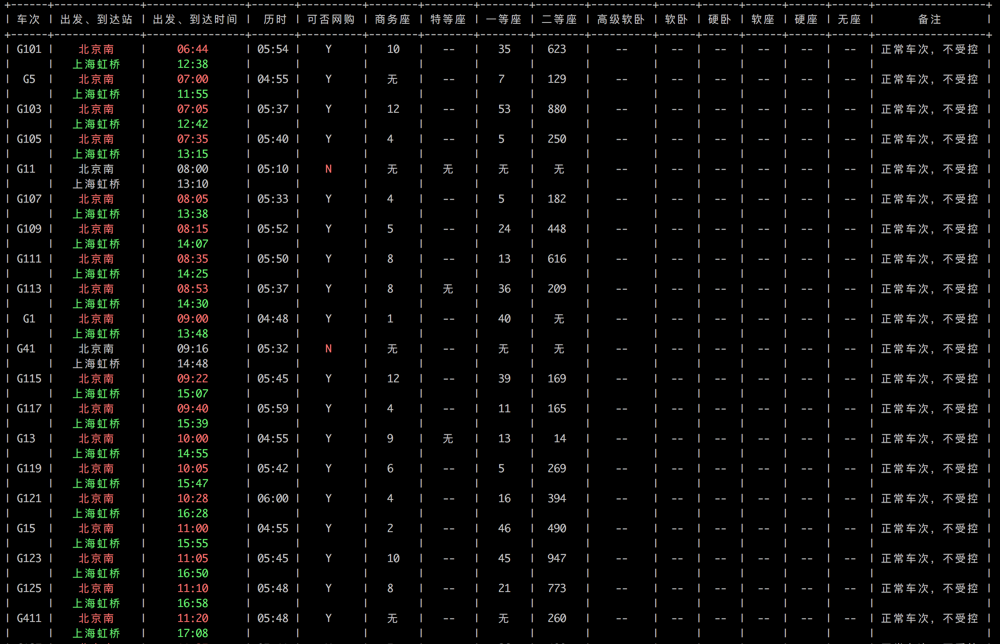

效果图：

#1.环境
脚本在Python 2.7.10环境下测试通过。  
需要安装Requests库、PrettyTable库以及命令行解析工具库Docopt。  
这三个库均可以通过pip来安装。
#2.使用说明
Usage: python tickets.py [-gdtzk] (from) (to) (date)  
其中，  
[]为可选，()为必需项。  
[-gdtzk]：对应高铁、动车、特快、直达、快速的filter。  
from和to：分别为始发站和目的站的拼音名。  
date格式：2016-10-02。
#3.原理与改进空间
12306通过获取用户的查询信息，将地名转换成三个英文字母的CODE进行query。  
BUG在于，拼音会重名，诸如“南京”和“南靖”。